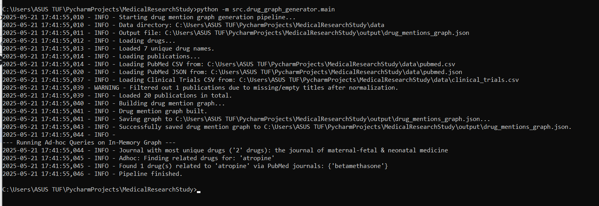
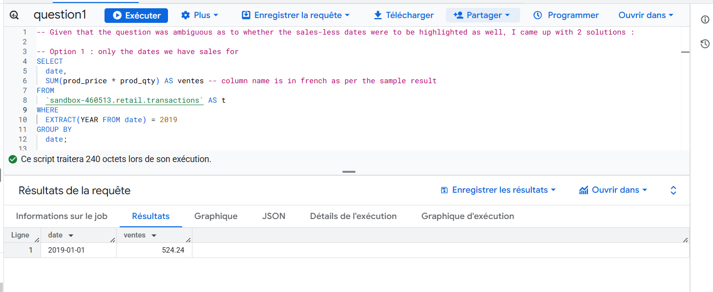
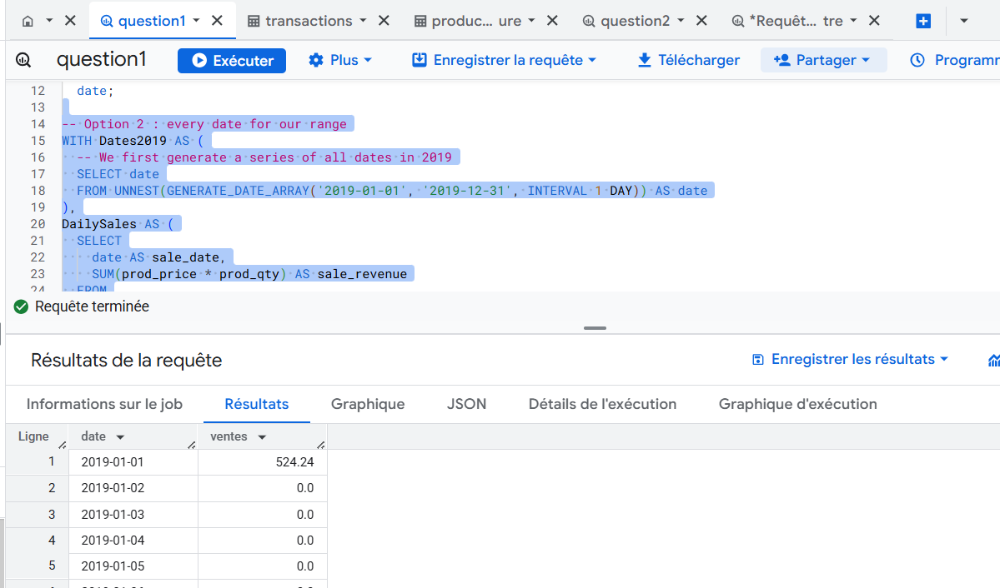
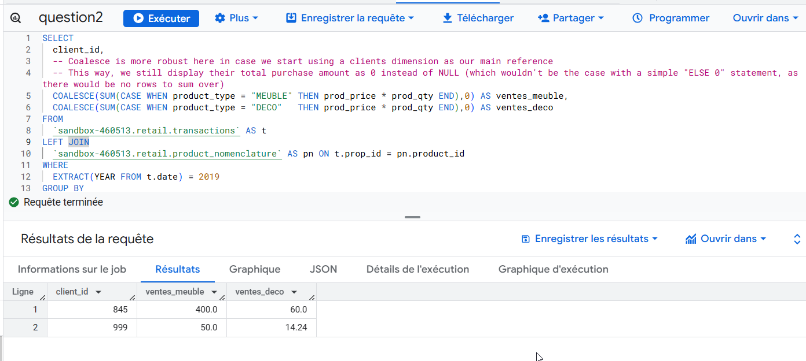

# MedicalResearchStudy - Drug Mention Graph Generator

This project implements a data pipeline to process information about drugs, PubMed publications, and clinical trials. It identifies mentions of specific drugs within publication titles and generates a JSON output representing a graph of these relationships, linking drugs to the journals and dates of their mentions.

This project serves as a technical assessment.

## Table of Contents

- [Project Objective](#project-objective)
- [Project Structure](#project-structure)
- [Input Data Sources](#input-data-sources)
- [Output](#output)
- [Setup and Installation](#setup-and-installation)
- [Running the Pipeline](#running-the-pipeline)
- [Data Quality Considerations & Handling](#data-quality-considerations--handling)
  - [Date Management](#date-management)
  - [Null/Empty Values](#nullempty-values)
  - [JSON Parsing (Trailing Commas)](#json-parsing-trailing-commas)
  - [Text Normalization](#text-normalization)
  - [Character Encoding](#character-encoding)
  - [Drug Name Matching](#drug-name-matching)
- [Future Considerations & Improvements](#scalability)

## Project Objective

The primary goal is to build a robust data pipeline that:
1.  Ingests data from multiple sources: `drugs.csv`, `pubmed.csv`, `pubmed.json`, and `clinical_trials.csv`.
2.  Cleans and standardizes the ingested data.
3.  Identifies mentions of drugs (from `drugs.csv`) within the titles of publications (from PubMed and Clinical Trials).
4.  Constructs a graph, represented as a JSON object, linking drugs to the journals that mentioned them, including the date and details of each mention.


## Input Data Sources

-   **`data/drugs.csv`**: Contains drug names and ATC codes. (Fields: `atccode`, `drug`)
-   **`data/pubmed.csv`**: PubMed article information. (Fields: `id`, `title`, `date`, `journal`)
-   **`data/pubmed.json`**: PubMed article information in JSON format. (Fields: `id`, `title`, `date`, `journal`)
-   **`data/clinical_trials.csv`**: Clinical trial information. (Fields: `id`, `scientific_title`, `date`, `journal`)

## Output

The pipeline generates a single JSON file:
-   **`output/drug_mentions_graph.json`**: This file contains the graph structure. The top-level keys are normalized drug names. Each drug maps to an object where keys are normalized journal names. Each journal name maps to a list of mention objects, each detailing a specific publication:
    ```json
    {
      "normalized_drug_name_1": {
        "normalized_journal_name_a": [
          {
            "date": "YYYY-MM-DD", // or "UNKNOWN_DATE" or original if unparseable
            "publication_title": "Original Publication Title...",
            "source_type": "pubmed_csv", // or pubmed_json, clinical_trials_csv
            "source_id": "original_publication_id_or_placeholder"
          }
        ],
        // ... other journals for drug_1
      },
      // ... other drugs
    }
    ```

## Setup and Installation

1.  **Clone the repository (if applicable):**
    ```bash
    git clone <repository_url>
    cd MedicalResearchStudy
    ```
2.  **Create and activate a Python virtual environment:**
    It is highly recommended to use a virtual environment to manage project dependencies.
    ```bash
    # Ensure you are in the MedicalResearchStudy project root
    python -m venv venv 
    ```
    Activate the environment:
    *   On macOS/Linux: `source venv/bin/activate`
    *   On Windows: `.\venv\Scripts\activate`

3.  **Install dependencies:**
    With the virtual environment activated, install the required packages:
    ```bash
    pip install -r requirements.txt
    ```

## Running the Pipeline

With the virtual environment activated and dependencies installed, run the pipeline from the **project root directory (`MedicalResearchStudy/`)**:

```bash
python -m src.drug_graph_generator.main
```

The script will:
- Load data from the `data/` directory.
- Process the data to find drug mentions.
- Generate the `drug_mentions_graph.json` file in the `output/` directory (this directory will be created if it doesn't exist).
- Print progress messages to the console.


Below is an example output for the pipeline (along with the adhoc queries).

#### Pipeline Run Results


# Data Quality Considerations & Handling

This pipeline incorporates several strategies to handle inconsistencies and potential issues in the input data:

### Date Management
-   **Problem**: Input dates appear in various formats (e.g., `DD/MM/YYYY`, `MM/DD/YYYY`, `YYYY-MM-DD`, "Month Day, Year"). The ambiguity between `DD/MM` and `MM/DD` (e.g., "03/04/2025") is a key challenge.
-   **Approach**:
    -   The `utils.parse_date` function attempts a series of `strptime` formats.
    -   **Priority**: `DD/MM/YYYY` (European/Standard) is attempted before `MM/DD/YYYY` (American) for ambiguous slash-separated dates, as it's considered more broadly standard in many contexts. Users should be aware of this assumption.
    -   Other common formats (`YYYY-MM-DD`, textual month names) are also handled.
    -   Commas are stripped from date strings before parsing.
    -   If a date cannot be parsed into `YYYY-MM-DD`, the original (comma-stripped) string or a placeholder (`UNKNOWN_DATE`) is used.
-   **Relevant Code**: `src/drug_graph_generator/utils.py` (`parse_date` function).

### Null/Empty Values
-   **Problem**: Fields like `id`, `title`, or `journal` can be missing or empty.
-   **Approach**:
    -   **IDs**: If an `id` is missing or empty, a unique placeholder ID is generated (e.g., `pubmed_json_item_0_no_id`) to ensure each record can be uniquely referenced internally. Your note "In our case, for the null ID cases we have, we'll just keep them" is interpreted as: we don't discard the record, but we *do* need an internal way to track it, hence the placeholder. The original `id` value (even if empty) is not directly used if it's problematic for keys.
    -   **Titles**: Publications with empty titles after normalization are filtered out before graph building, as drug matching cannot occur. Original titles (even if empty) are stored in the `original_title` field.
    -   **Journals**: If a journal name is missing or empty, a placeholder (e.g., `unknown_journal`) is used for consistent grouping in the output graph.
-   **Relevant Code**: `src/drug_graph_generator/data_loader.py` (within `_create_publication_entry` and specific loader classes).

### JSON Parsing (Trailing Commas)
-   **Problem**: The `pubmed.json` file example includes a trailing comma, which is invalid in strict JSON and causes errors with Python's standard `json.load()`.
-   **Approach**: The `json5` library is used to parse input JSON files (`pubmed.json`). `json5` is more lenient and handles common non-standard JSON features like trailing commas. The output JSON generated by the pipeline is still strict standard JSON using `json.dump()`.
-   **Relevant Code**: `src/drug_graph_generator/data_loader.py` (in `PubMedJSONLoader`), `import json5`.

### Text Normalization
-   **Problem**: Drug names, titles, and journal names may appear with different casings or leading/trailing whitespace.
-   **Approach**: The `utils.normalize_text` function converts text to lowercase and strips whitespace. This is applied to:
    -   Drug names (for storage and matching).
    -   Publication titles (for searching/matching drugs).
    -   Journal names (for use as consistent keys in the output graph).
    The original, unnormalized publication titles are preserved for readability in the final JSON output.
-   **Relevant Code**: `src/drug_graph_generator/utils.py` (`normalize_text`), used throughout `data_loader.py`.

### Character Encoding
-   **Problem**: Input files might use non-ASCII characters (e.g., `ñ` in `clinical_trials.csv` as `\xc3\xb1`) or include a Byte Order Mark (BOM).
-   **Approach**:
    -   Files are generally opened with `encoding='utf-8'`.
    -   For CSV files potentially containing a BOM (like `clinical_trials.csv`), `encoding='utf-8-sig'` is used to correctly handle it.
    -   A second, regex-based transformation is made thereafter to ensure no trailing badly encoded characters remain.
    -   Output JSON is written with `ensure_ascii=False` to preserve non-ASCII characters correctly.
-   **Relevant Code**: File opening statements in `data_loader.py`, `json.dump` in `main.py`.

### Drug Name Matching
-   **Problem**: Simple substring matching (e.g., `"ace" in "face cream"`) can lead to false positives.
-   **Approach**: Drug names and publication titles are normalized (lowercased). The `processing.build_drug_mention_graph` function uses regular expressions (`re.search` with `\b` word boundaries: `r'\b' + re.escape(drug_name) + r'\b'`) to match whole drug words within the normalized titles. `re.escape` is used to handle any special regex characters within drug names themselves.
-   **Relevant Code**: `src/drug_graph_generator/processing.py` (`build_drug_mention_graph`).

### Scalability

The current pipeline processes data in memory and would not scale to terabytes of data or millions of files. To handle such volumes, significant architectural changes would be necessary:

*   **Iterative Processing & Orchestration:** For continuously arriving data or extremely large historical datasets, an iterative or streaming approach would be preferable over full re-computation. The overall pipeline would be orchestrated by a tool like Apache Airflow, managing the execution of distributed jobs (e.g., Spark applications) rather than a single Python script. Utility functions for normalization and parsing would be adapted for use within the distributed framework (e.g., as UDFs).

*   **Distributed Processing & Storage:** The core modification would involve adopting a distributed processing framework like Apache Spark or Dask. Data ingestion would change from loading entire files into Python lists to distributed reading (e.g., `spark.read.csv()`). Input data and intermediate results would be stored in scalable systems like cloud object storage (S3, GCS, Azure Blob) or HDFS, ideally using analytics-optimized columnar formats like Apache Parquet.

*   **Algorithmic Optimization:** Most of the functions we're using use a fairly naive approach and do not optimize for time and space complexity. If we were to have large datasets, we would need to seek those marginal gains.


## SQL Queries for Sales Analysis

This project includes SQL queries designed for analyzing sales data from the `TRANSACTIONS` and `PRODUCT_NOMENCLATURE` tables, as specified in Part II of the technical test. These queries are written for Google BigQuery and can be found in the `queries/` directory.

*   **`queries/daily_revenue.sql`**:
    *   **Objective:** Calculates the total daily sales revenue (`ventes`) for the year 2019.
    *   **Key Considerations & Logic:**
        *   Two approaches are presented: one showing sales only for dates with transactions, and a preferred second option that ensures *all dates in 2019 are displayed*.
        *   The second option achieves this by generating a complete 2019 date series and `LEFT JOIN`-ing it with aggregated daily sales. `COALESCE` is then used to present `0` revenue for dates without sales, providing a comprehensive daily view.
        *   Filtering is applied for the year 2019 using `EXTRACT(YEAR FROM date)`.
    *   **Expected Output Columns (for the comprehensive option):** `date`, `ventes`

*   **`queries/sale_types_per_user.sql`**:
    *   **Objective:** Determines the total sales for "MEUBLE" (furniture) and "DECO" (decoration) product types per client for the year 2019.
    *   **Key Considerations & Logic:**
        *   Utilizes a `LEFT JOIN` between `TRANSACTIONS` and `PRODUCT_NOMENCLATURE` to link sales to product types.
        *   Employs conditional aggregation (`SUM(CASE WHEN ... END)`) to pivot sales into `ventes_meuble` and `ventes_deco` columns.
        *   Critically, `COALESCE(..., 0)` is applied to these sums. This ensures that clients with sales in 2019 but none for a specific product type (e.g., no "MEUBLE" sales) will show `0` for that category, rather than `NULL`. This approach enhances data presentation and is robust for scenarios where one might `LEFT JOIN` from a `clients` dimension, ensuring all clients are represented even if they have no relevant transactions.
        *   Filters for transactions within 2019 and groups results by `client_id`.
    *   **Expected Output Columns:** `client_id`, `ventes_meuble`, `ventes_deco`

**Assumptions for SQL Queries:**
*   Tables are named `transactions` and `product_nomenclature` (or fully qualified paths).
*   Relevant columns (`date`, `prod_price`, `prod_qty`, `product_type`) exist with appropriate data types.

Below are example outputs for the SQL queries.

#### Daily Revenue Results (`queries/daily_revenue.sql` - Option 1)


#### Daily Revenue Results (`queries/daily_revenue.sql` - Option 2)


#### Sale Type per User Results (`queries/daily_revenue.sql`)


